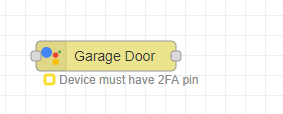
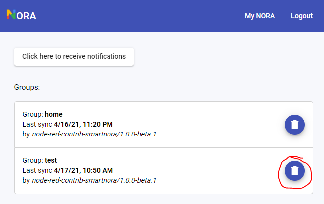
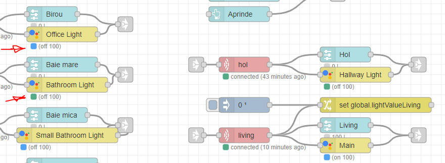

## How can I migrate from the old NORA service
Unfortunately it's a manual process as this is a completely new service.
All the nodes in Smart NORA are backwards compatible with the old NORA nodes so just copying over the settings from each of the old nodes should do the trick.

The main difference in the new version is that the only accepted signin method is email + password and there is no more token copied from the main page.

## Some devices show no status in Google Home app and can only be controlled using voice
The widget that shows up for a device type in the Google Home application is not under our control. The Google Home application is developed and maintained by the team over at Google and we have no way of changing its behaviour. 

Also, devices that have secondary verification enabled can not be controlled via the touch interface of the Google Home application, only via voice.

## My Garage/Lock device is not showing up in Google Home
Google requested all Garage/Lock devices should require pin secondary verification setup for security reasons. If you have the latest `node-red-contrib-smartnora` package, the error should be visible under the node.

In a future release there will be a checkbox in the node-red UI to opt-out of this security restriction once the user acknowledges the security risks.

## I have ghost devices in my Google Home application
This can happen if you use/change the group name in the Smart NORA configuration node. The group name is intended to be used if you have multiple instances of Node RED connected to the same Smart NORA account.

If you change the group name, Smart NORA has no way of knowing if the group was actually deleted or the device that was using the old name just went offline.

In order to delete the unused groups, just head over to [Smart NORA](https://smart-nora.eu/my-nora), login and you will be able to see all the groups synced on your account. Here you can delete the groups you don't want to use. This will trigger a resync with Google Home.

## I can't link to Google. Each time I try to link, I just get redirected back to Add device page
Not sure exactly why this happens but it seems to happen when there are no devices to sync in node-red. Please make sure you define at least one device before trying to link with Google Home.

## How does local execution work
In order for local execution work you need to have a `Google Home` [compatible device](https://developers.google.com/assistant/smarthome/concepts/local#supported-devices) in the same network as the `node-red` instance you're running Smart NORA. The `Google Home` device(s) will load a local execution application that broadcasts UDP messages in order to discover any Smart NORA instances running locally and send commands to them.

The ports used are:
- 6988 - used to broadcast the discovery packet from Google Home
- 6989 - used by node-red to reply to the discovery packet
- 6987 - used to send commands from Google Home to Smart NORA

## How can I check if local execution is working
Navigate, using a Chrome Browser, to `chrome://inspect/#devices`. Here you should be able to see all your local `Google Home` compatible devices and under each there will be the `Local Execution NORA` script.

Clicking `inspect` under any of them should reveal the debug messages used to discover local devices and send commands to them.

It might take a few hours after linking until the Google Home devices start using the local execution path.

