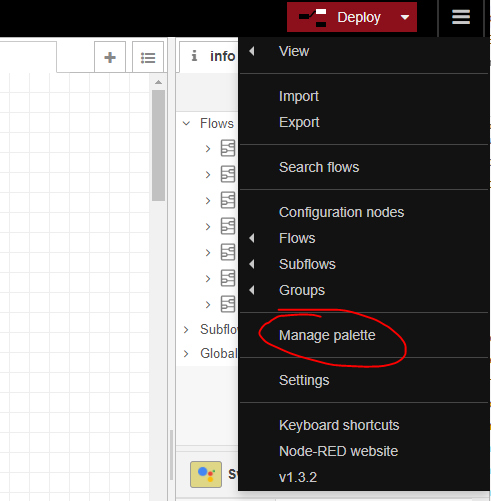
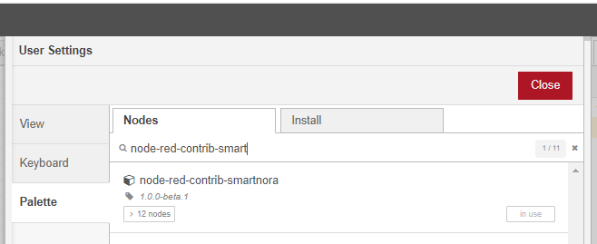
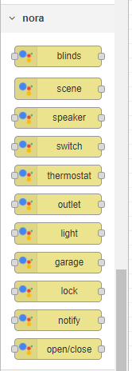
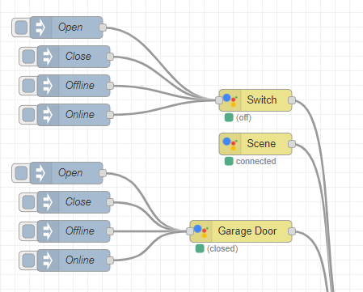
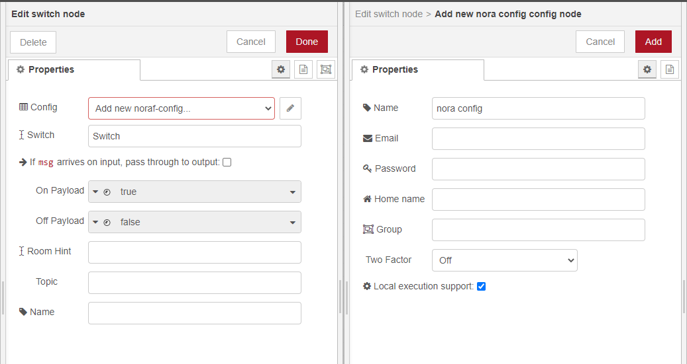
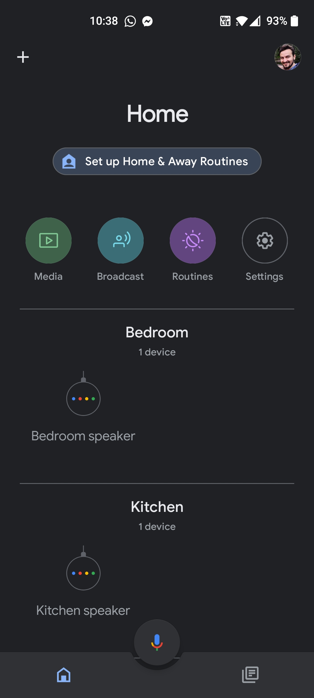
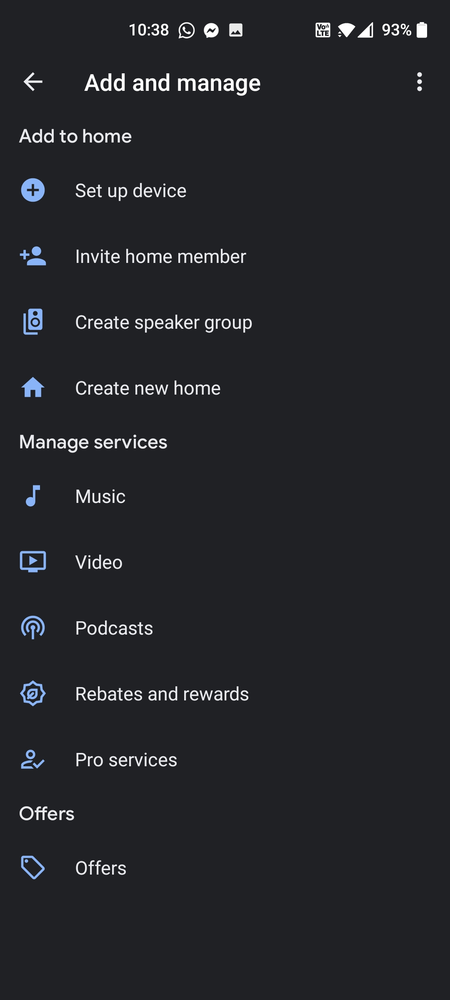
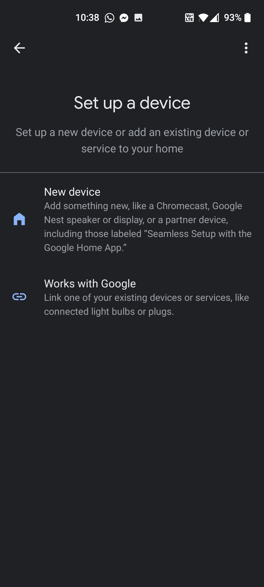
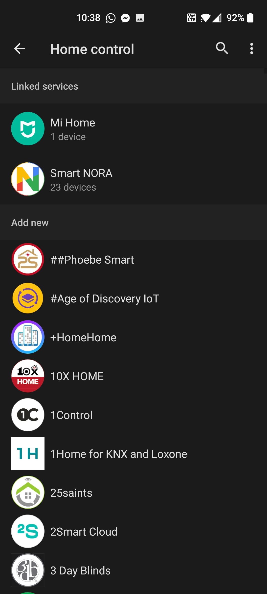

## Node-RED (*These steps need to happen only once*)

1. Open your node-red instance and install `node-red-contrib-smartnora`. You can do this by clicking the hamburger menu in the top-right corner and select `Manage palette`, select `Install`, type `node-red-contrib-smartnora` and click the install button.

2. After installation is complete a new set of nodes shoud appear under nora category

## Create a Smart NORA account (*These steps need to happen only once*)

1. Go to [Smart NORA homepage](https://smart-nora.eu/)
2. Create an account using your email address and a password
3. Verify your email address by clicking the link in the email

## Create/Adapt a Node-RED flow

1. Create a new flow (or open the existing one you want to use) and add the Smart NORA nodes you plan to use. Each Smart NORA node will correspond to a Google Home device. In this case we are going to use a light node.

2. Edit the light node. Add a new nora-config (configs can be reused between multiple nora devices) in which you need to enter your credentials (email/password) used when you created your Smart NORA account. The `Group` is used if you want to use multiple connections to the same Smart NORA account (if you use multiple Node-RED instances - **leave it blank if you don't plan on using multiple instances**).

3. Deploy your flow

### Link to Google Home (*These steps need to happen only once*)
Once you have **at least one** Smart NORA device you can link your Google Home to Smart NORA

1. Open your Google Home and click Add

2. In the `Add and manage` screen, select `Set up device`.

3. Select `Have something already set up?`

4. Select `Smart NORA` (in this image it's already linked) and login again with the account you created on the Smart NORA homepage.

The devices setup in Node-RED will sync with your Google Home and now you are able to control them via voice/routines/etc.